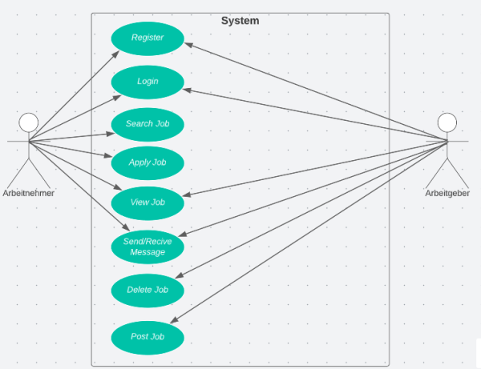
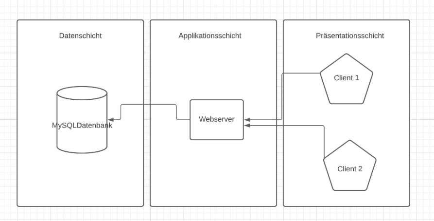

= Einleitung

Auf der einen Seite sind viele Schüler und Studenten auf der Suche nach einem Praktikum. Sei es, weil sie Geld verdienen wollen oder
weil sie Arbeitserfahrung sammeln wollen oder auch weil die Schule vorschreibt ein Praktikum zu machen. 
Auf der anderen Seite gibt es Arbeitergeber oder Firmen, die durch die Praktika junge Leute anwerben wollen. 
Das online Portal Praktex sorgt dafür, dass Schüler und Studenten die auf der Suche nach einem Praktikum sind, einen Praktikumsplatz bekommen und im Umkehrschluss können Firmen junge Praktikanten einstellen, um einen Pool an künftigen potenziellen Mitarbeitern aufzubauen.
Ebenfalls ist die Ausschreibung für Diplomarbeiten möglich. Dies ist über andere Anbieter relativ schwer zu finden, da doch meißtens nur Praktikas ausgeschrieben werden.

== Ausgangssituation und Zielsetzung
Wir selber sind Schüler und wir wissen nur zu gut wie es ist nach einem passenden Praktikum zu suchen.
Praktex unterscheidet sich von anderen Jobportalen darin, dass unser Fokus nur darin besteht Praktika und Diplomarbeiten anzubieten. 
Außerdem sind die viele Firmen in anderen Jobportale meistens auf der Suche nach Praktikanten, die entweder schon eine abgeschlossene Ausbildung haben oder auch ältere Studenten. 
Praktex hingegen hat das Ziel Unternehmen zu bevorzugen die mehr mit Schülern arbeiten wollen. 
Aber auch für Schüler soll die Suche nach einem Praktikum bzw. Diplomarbeit erleichtert werden, da man nach dem aktuellen Modell auf verschiedenen Seiten die Angeboten auszuchen hat.

== Funktionale Anforderungen

== Nicht-funktionale Anforderungen
Die Seriosität der Anbieter kann nicht garantiert werden

== Gesamtsystemarchitektur

== Anforderungen an die Funktionssicherheit
 * 2 Faktor Authentifikation Sicherheit
 * Bei Bugs oder Fehlern gibt es auf der Webapplikation einen Punkt Kontakt worin uns  eine Email geschickt werden kann.
 * Server läuft dauerhaft
 * Persistenz der Daten

== Lieferumfang
* 3 Laptops

== Abnahmekriterien und Vorgehen zur Abnahmeprüfung
* vollständiges Testen der Applikation
* Normalformen in der Datenbank für Schnelligkeit => Effizienz
* Persistenz der Daten
* eine Responsezeit von unter 200ms bei verschiedenen Abfragen
